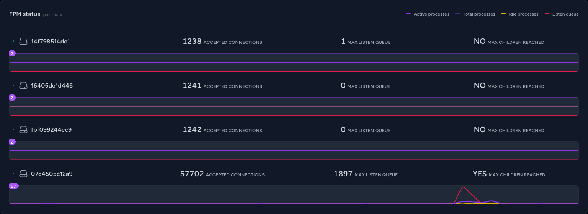

# PHP FPM status card for Laravel Pulse

Get real-time insights into the status of your PHP FPM with this convenient card for Laravel Pulse.

## Example



## Installation

Install the package using Composer:

```shell
composer require maantje/pulse-php-fpm
```

## Enable PHP FPM status path

Configure your PHP FPM status path in your FPM configuration:

```
pm.status_path = /status
```

## Register the recorder

In your `pulse.php` configuration file, register the PhpFpmRecorder with the desired settings:

```php
return [
    // ...
    
    'recorders' => [
        PhpFpmRecorder::class => [
            // Optionally set a server name gethostname() is the default
            'server_name' => env('PULSE_SERVER_NAME', gethostname()),
            // Optionally set a status path the current value is the default
            'status_path' => 'localhost:9000/status', // with unix socket unix:/var/run/php-fpm/web.sock/status
            // Optionally give datasets, these are the default values.
            // Omitting a dataset or setting the value to false will remove the line from the chart
            // You can also set a color as value that will be used in the chart
            'datasets' => [
                'active processes' => '#9333ea',
                'total processes' => 'rgba(147,51,234,0.5)',
                'idle processes' => '#eab308',
                'listen queue' => '#e11d48',
            ],
        ],
    ]
]
```

Ensure you're running [the `pulse:check` command](https://laravel.com/docs/10.x/pulse#capturing-entries).

## Add to your dashboard

Integrate the card into your Pulse dashboard by [publish the vendor view](https://laravel.com/docs/10.x/pulse#dashboard-customization).
and then modifying the `dashboard.blade.php` file:

```diff
<x-pulse>
    <livewire:pulse.servers cols="full" />
    
+   <livewire:fpm cols="full" />

    <livewire:pulse.usage cols="4" rows="2" />

    <livewire:pulse.queues cols="4" />

    <livewire:pulse.cache cols="4" />

    <livewire:pulse.slow-queries cols="8" />

    <livewire:pulse.exceptions cols="6" />

    <livewire:pulse.slow-requests cols="6" />

    <livewire:pulse.slow-jobs cols="6" />

    <livewire:pulse.slow-outgoing-requests cols="6" />

</x-pulse>
```

And that's it! Enjoy enhanced visibility into your PHP FPM status on your Pulse dashboard.
